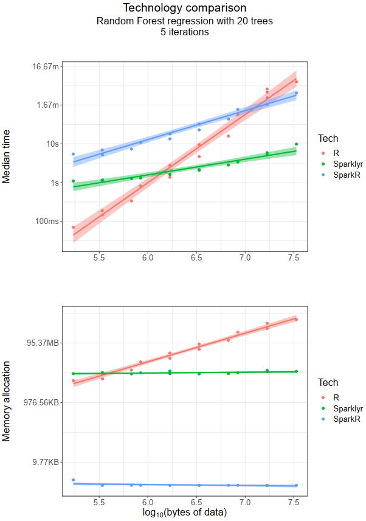
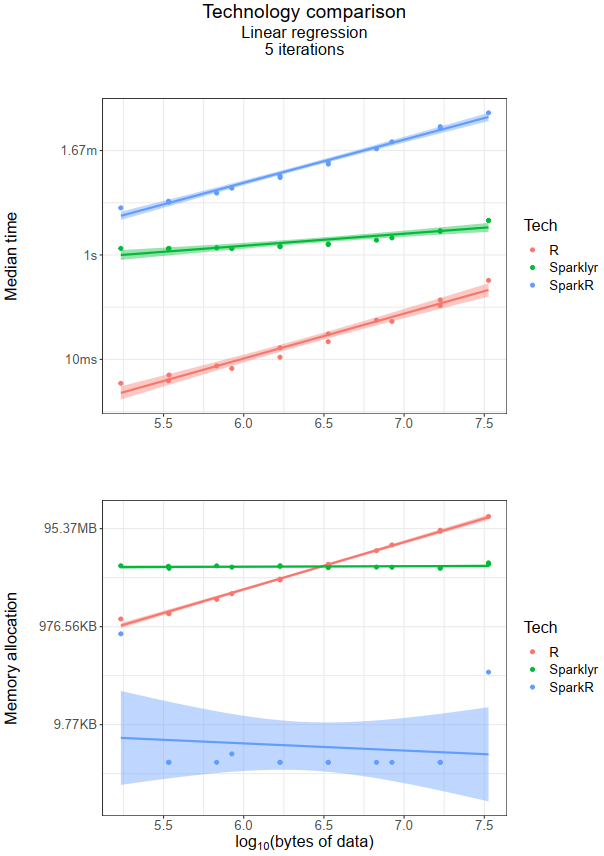

Apache <a href="https://spark.apache.org/" target="_blank">Spark</a> has become the go-to technology for large-scale data analyses. It provides support for multiple programming languages such as R, Python, Java and Scala. Compared to `R`, Spark is impressively fast in loading and handling large datasets (~40 million observations with 14 variables), but there are only a handful of blogs benchmarking Spark and `R` with real world examples (I found a few <a href="https://databricks.com/blog/2018/05/03/benchmarking-apache-spark-on-a-single-node-machine.html" target="_blank">here</a>, <a href="https://bigdata-madesimple.com/tools-in-the-data-armoury-r-vs-spark/" target="_blank">here</a> and <a href="https://databricks.com/blog/2018/08/15/100x-faster-bridge-between-spark-and-r-with-user-defined-functions-on-databricks.html" target="_blank">here</a>). None of these address the benchmarking in `R` from a machine learning point of view, and I am going to attempt to do that.

## Data

I previously simulated ~40 million observations using Python (I will write a post about it soon). For this exercise, I took 1% of this simulated dataset (~400,000 observations with 14 variables). To increase the dimensionality of the dataset, I replicated the variables twice, giving a final dataset of ~400,000 observations with 42 variables (including a response variable, `y`). All observations were numeric. The analysis was carried out in RStudio v1.2.5001.

## Machine learning in R, SparkR and Sparklyr

Apache Spark has its own `R` API called <a href="https://spark.apache.org/docs/latest/sparkr.html" target="_blank">SparkR</a>. A quick glance at Spark's official Machine Learning documentation (<a href="https://spark.apache.org/docs/latest/ml-guide.html" target="_blank">MLlib</a>) will tell you that few algorithms are not supported in `SparkR`. This is where the makers of RStudio come in, with their own `R` API called <a href="https://spark.rstudio.com" target="_blank">sparklyr</a>. `sparklyr` bridges some of the gaps (you can read more about it <a href="https://eddjberry.netlify.com/post/2017-12-05-sparkr-vs-sparklyr/" target="_blank">here</a> and <a href="https://community.rstudio.com/t/sparkr-vs-sparklyr-today/18532" target="_blank">here</a>). 
In this post, I benchmarked two machine learning algorithms, random forest (RF) and linear regression (LR), on `R`, `SparkR` and `sparklyr`. For both algorithms (RF and LR), the aim was to predict the values of `y`.

## Benchmarking

I used the `bench` package which comes with a useful function called `press`. I won't go into detail (more information can be found <a href="https://github.com/r-lib/bench#benchpress" target="_blank">here</a>), as it is better to demonstrate this with the sample code below (benchmarking RF and LR in `R`) - 
```
resultR <- bench::press(
  rows = c(1000, 2000, 5000, 10000, 20000, 50000, 100000, 200000, nrows),
  cols = c(ncols/2, ncols),
  {
    dat <- test[1:rows, 1:cols]
    bench::mark(iterations = 5, check = FALSE, min_time = Inf,
                rfR = randomForest(y ~ . , data = dat, ntree = 20),
                lmR = lm(y ~ . , data = dat)
    )
  }
)
```
One can think of `press` as two nested `for` loops, one for `rows` and one for `cols`. The benchmarking was done over 5 iterations of each algorithm. Algorithm parameters in `R`, `SparkR` and `sparklyr` were kept the same for a fair comparison.

## Results
I will break down the results for each algorithm separately, as results are quite different. The focus was on `running time` and `memory` used (y-axis) as the size of the data increases (x-axis).

### Random forest

Short story

* Time wise, `R` performs better with a smaller dataset (~100kb). For a larger dataset, `sparklyr` takes over. 
* From a memory perspective, `sparklyr` is still better (as most modern laptops/desktops can accommodate ~100Mb of memory).

<p>

</p>

### Linear regression

Short story:

* Time wise, `R` performed better irrespective of data size (although for a dataset larger than the one used in this blog, `sparklyr` is likely to become faster than `R`).
* From a memory perspective, `SparkR` beats `R` and `sparklyr` (again!).

<p>

</p>

## Conclusion

This blog touched the surface of benchmarking 3 technologies (`R`, `SparkR` and `sparklyr`). It highlighted the advantages and disadvantages of these technologies in the context of machine learning algorithms and size of the data. When considering which technology to use for your analysis, it is wise to benchmark the algorithm(s) you would be deploying.

### sessioninfo()

The following are the `R` packages and system information - 

```
R version 3.6.0 (2019-04-26)
Platform: x86_64-w64-mingw32/x64 (64-bit)
Running under: Windows Server >= 2012 x64 (build 9200)

Matrix products: default

locale:
[1] LC_COLLATE=English_United States.1252 LC_CTYPE=English_United States.1252 LC_MONETARY=English_United States.1252 LC_NUMERIC=C LC_TIME=English_United States.1252    

attached base packages:
[1] grid      stats     graphics  grDevices utils     datasets  methods   base     

other attached packages:
[1] SparkR_2.3.2        sparklyr_1.0.2      randomForest_4.6-14 ggplot2_3.2.1       bench_1.0.4         dplyr_0.8.3        

loaded via a namespace (and not attached):
 [1] Rcpp_1.0.2       dbplyr_1.4.2     pillar_1.4.2     compiler_3.6.0   r2d3_0.2.3       base64enc_0.1-3  tools_3.6.0      digest_0.6.20    jsonlite_1.6     tibble_2.1.3     gtable_0.3.0     pkgconfig_2.0.2  rlang_0.4.0     
[14] DBI_1.0.0        rstudioapi_0.10  yaml_2.2.0       withr_2.1.2      httr_1.4.1       generics_0.0.2   htmlwidgets_1.3  rprojroot_1.3-2  tidyselect_0.2.5 glue_1.3.1       forge_0.2.0      R6_2.4.0         purrr_0.3.2     
[27] magrittr_1.5     ellipsis_0.2.0.1 scales_1.0.0     backports_1.1.4  htmltools_0.3.6  assertthat_0.2.1 colorspace_1.4-1 lazyeval_0.2.2   munsell_0.5.0    crayon_1.3.4

```
